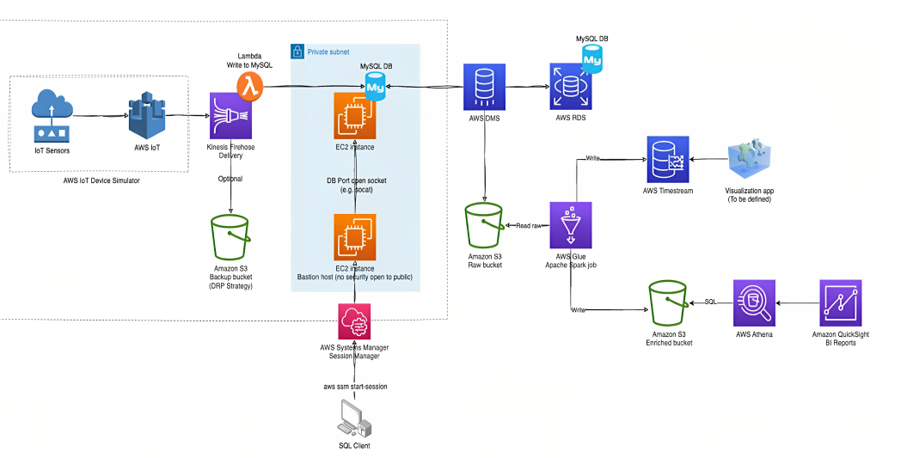

# Migration of MySQL Databases (IoT based data) to AWS 

This project aims to perform real-time data migration from an on-premise database to AWS, leveraging AWS DMS and SCT for seamless migration and replication. By using AWS Glue, AWS Timestream, and AWS S3, the project aims to migrate and analyze data, schemas, tables, and functions from the MySQL server to "AWS Cloud Premise," enabling efficient data management and analysis. The project emphasizes the importance of real-time data migration, scalability, cost savings, data security, and analysis for business success.

## Advantages of Real-Time IoT Data Storage and Analysis

- Improved operational efficiency
- Better decision-making
- Enhanced customer experience
- Cost savings
- Competitive advantage

## Tech Stack

- AWS IoT
- AWS CDK
- AWS Secrets Manager
- Kinesis Firehose
- AWS Lambda
- MariaDB

## Steps 

1. Firstly, we need to set up the AWS IoT Device Simulator to replicate an on-premise data center infrastructure by simulating multiple IoT devices generating geoLocation data near The O2 Arena in London.

2. Use AWS CDK (Cloud Development Kit) to provision the necessary AWS resources, like AWS IoT Core, Kinesis Firehose, AWS Lambda, MariaDB, AWS S3, and AWS Secrets Manager.

3. Configure the AWS IoT Device Simulator to generate and simulate real-time IoT data, focusing on the geoLocation data of multiple devices.

4. Define device properties and behaviors within the AWS IoT Device Simulator, and customize the simulations (I used 10 devices and 30 secs for simulation).

5. Implement data ingestion workflows using AWS Kinesis Firehose to capture and transform the simulated IoT data.

6. Use the AWS Lambda functions for real-time data processing and integration with other AWS services.

7. Store the processed data in AWS S3 and MariaDB, for efficient data storage and retrieval.

8. Implement security measures using AWS Secrets Manager to securely manage sensitive information such as credentials.

9. Integrate with other AWS services like AWS Glue, AWS Timestream, and QuickSight for data analysis, reporting, and visualization.

## Project Architecture

